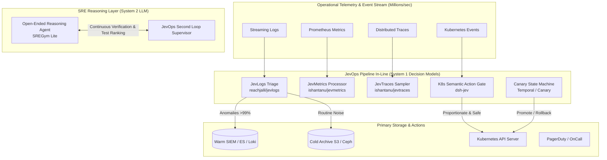

# JevOps: Decision Models for Cloud-Native Infrastructure & DevOps

[](LICENSE)
[](#%EF%B8%8F-disclaimer--architectural-reference)
[](#%EF%B8%8F-disclaimer--architectural-reference)
[](docs/03-airgap-openshift-4-20.md)
[](docs/04-hyperscaler-architectures.md)
[](components/01-semantic-telemetry-otel/)
[](tests/)

> [!WARNING]
> ### ⚠️ Disclaimer & AI Provenance
> This repository was architected and generated with **Gemini 3.8 Flash** based on Josh Rosen's article [*"JevOps: Early Signs Decision Models Are Transforming DevOps"*](https://x.com/JoshARosen/status/2104201747732271519) and its referenced ecosystem projects.
>
> **Architectural Reference Only — Not Tested in Production**:
> - This project serves strictly as an **architectural reference, conceptual blueprint, and educational proof-of-concept (PoC)** to catalyze exploration of System 1 decision models in cloud-native infrastructure.
> - **It has NOT been tested in a real production environment**, live OpenShift 4.20+ datacenter, or live hyperscaler cluster (AKS/EKS/GKE).
> - All Kubernetes manifests, SecurityContextConstraints, NetworkPolicies, Helm charts, and webhook controllers are illustrative and must be thoroughly audited, tested, and validated by your platform team in isolated non-production sandbox environments before any operational adoption.

> *"DevOps may be one of the largest untapped use cases for decision models... DevOps is packed with exactly the kind of small semantic decisions Jev is built to make."*  
> — **Josh Rosen** ([@JoshARosen](https://x.com/JoshARosen/status/2104201747732271519))

---

## 📖 Overview

**JevOps** implements the full operational paradigm and all referenced systems from Josh Rosen's foundational article on **Decision Models in DevOps**.

Instead of routing operational infrastructure through slow (2–15s), expensive ($5–$20/1M tokens) generative LLMs, JevOps introduces **System 1 Decision Models** (exemplified by TypeSafe's Jev):
- **Reflexive & Fast**: 50ms – 250ms cloud latency, or **<1ms** with the local air-gapped engine.
- **Micro-Cost**: ~$0.042 per million input tokens (~1% of LLM cost), enabling continuous semantic decisions across millions of telemetry events.
- **Strictly Typed & Schema-Constrained**: Emits typed primitives (`Choice`, `Score`, `Noul`/boolean) with confidence probabilities—**zero hallucinations**.
- **Embedded in Operational Pipelines**: Placed directly inside OpenTelemetry Collectors, Kubernetes Admission Webhooks, SRE Dual-Loop supervisors, CI/CD runners, and Progressive Delivery controllers.
- **Enterprise Ready**: Turnkey support for **Red Hat OpenShift 4.20+ (on-prem air-gapped and cloud ROSA/ARO)**, **AKS**, **EKS**, and **GKE**.

---

## 🏛 Architecture: System 1 vs System 2 in DevOps



---

## 📚 Complete Reference Atlas

This repository contains fully tested, working code implementations of every reference cited in Josh Rosen's article:

| Reference | Domain | JevOps Implementation | Documentation |
| :--- | :--- | :--- | :--- |
| **Cribl AI Research** | Telemetry Pipelines & Parser Selection | [`components/01-semantic-telemetry-otel/`](components/01-semantic-telemetry-otel/) | [Docs](docs/02-reference-atlas.md#1-cribl-ai-research) |
| **`reachjalil/jevlogs`** | Log Triage & HDFS/BGL Benchmark | [`jevlogs_triage.py`](components/01-semantic-telemetry-otel/jevlogs_triage.py) | [Docs](docs/02-reference-atlas.md#2-jev-logs) |
| **`jevernetes`** | Live Kubernetes Log Inspection | [`core/local_engine.py`](core/jevops_core/local_engine.py) | [Docs](docs/02-reference-atlas.md#3-jevernetes) |
| **`jevbrief`** | Log Context Compression (1,447 logs -> 23 clusters) | [`jevbrief_compressor.py`](components/01-semantic-telemetry-otel/jevbrief_compressor.py) | [Docs](docs/02-reference-atlas.md#4-jevbrief) |
| **`ishantanu/jevmetrics`** | Metric Metadata Evaluation & Churn Reduction | [`jevmetrics_processor.py`](components/01-semantic-telemetry-otel/jevmetrics_processor.py) | [Docs](docs/02-reference-atlas.md#5-jevmetrics) |
| **`ishantanu/jevtraces`** | Span Criticality & Tail Sampling | [`jevtraces_tail_sampler.py`](components/01-semantic-telemetry-otel/jevtraces_tail_sampler.py) | [Docs](docs/02-reference-atlas.md#6-jevtraces) |
| **Datadog Agent Evals** | Online Evaluation of Production Agent Spans | [`core/client.py`](core/jevops_core/client.py) | [Docs](docs/02-reference-atlas.md#7-datadog-agent-observability) |
| **`SREGym Lite`** | SRE Dual-Loop Architecture & Test Ranking | [`components/03-sre-agent-dual-loop/`](components/03-sre-agent-dual-loop/) | [Docs](docs/02-reference-atlas.md#8-sregym-lite) |
| **`dsh-jev` (DeepSeek)** | K8s Semantic Action Gates (Postgres Exposure) | [`components/02-k8s-semantic-action-gate/`](components/02-k8s-semantic-action-gate/) | [Docs](docs/02-reference-atlas.md#9-semantic-gates-on-actions) |
| **`jev-oncall` / Router** | Confidence-Gated Alert Decomposition | [`components/05-incident-decomposition/`](components/05-incident-decomposition/) | [Docs](docs/02-reference-atlas.md#10-incident-response-decomposition) |
| **`jev-ci-pathfinder`** | Semantic CI Test & Job Selection | [`components/06-ci-semantic-pathfinder/`](components/06-ci-semantic-pathfinder/) | [Docs](docs/02-reference-atlas.md#11-ci-and-semantic-selection) |
| **Deployment State Machine** | Progressive Delivery Hold/Promote/Rollback | [`components/04-progressive-delivery/`](components/04-progressive-delivery/) | [Docs](docs/02-reference-atlas.md#12-progressive-delivery) |
| **John Rood's Law** | Resilient Degraded Defaults ("Fail Toward Noise") | [`core/fallback.py`](core/jevops_core/fallback.py) | [Docs](docs/05-resilience-and-fallbacks.md) |

---

## ⚡ Interactive Demos

Run all 5 scenarios end-to-end with zero dependencies:

```bash
bash demos/run_all_demos.sh
```

| Demo Script | Scenario | Outcome |
| :--- | :--- | :--- |
| **`demo1_otel_log_triage.py`** | Streams 250 records through log triager | **100% anomaly recall**, 100% routine noise filtered in 0.01s |
| **`demo2_k8s_action_gate.py`** | SRE agent proposes wide NetworkPolicy | **Blocks** `0.0.0.0/0` Postgres exposure; **Approves** scoped pod policy |
| **`demo3_sre_dual_loop.py`** | Dual-loop Kubernetes crash troubleshooting | Ranks hypotheses, gates premature diagnosis, verifies mitigation |
| **`demo4_canary_rollback.py`** | Progressive canary rollout with latency spike | Promotes 5% -> 25%, detects DB deadlock at 45% -> **Instant Rollback** |
| **`demo5_airgap_and_failover.py`** | Offline execution & intentional decider outage | Validates local engine & **John Rood's "Fail Toward Noise"** law |

---

## 🛡 John Rood's Law of Degraded Defaults

A fundamental operational requirement: **What does the pipeline do when the decider is down or slow?**

> *"Pick the degraded default per decision, and pick it toward noise: keep everything, page anyway. The only calls that get to fail quiet are the reversible ones."*

- **Reversible decisions** (e.g. Telemetry routing): Fail toward noise -> **retain 100% of logs, metrics, and traces**.
- **Irreversible mutations** (e.g. Kubernetes admission): Fail safe -> **block the change**.
- **Alert notifications**: Fail toward noise -> **page the oncall engineer anyway**.
- **Circuit Breaker**: Built-in circuit breaker trips `OPEN` if latency exceeds the 250ms SLA, protecting pipeline throughput.

---

## 🚀 Multi-Platform Deployment

### 1. Red Hat OpenShift 4.20+ (Air-Gapped & Disconnected)
Deploy the local decision engine sidecar with strict `restricted-v2` SCC compliance:
```bash
# Apply Security Context Constraints and deployment
oc apply -f deploy/openshift-4.20/scc-restricted-v2.yaml
oc apply -f deploy/openshift-4.20/local-decision-engine-pod.yaml
oc apply -f deploy/openshift-4.20/network-policy.yaml
```
For disconnected registry mirroring, use [`deploy/openshift-4.20/oc-mirror-imageset.yaml`](deploy/openshift-4.20/oc-mirror-imageset.yaml).

### 2. Hyperscalers: AKS, EKS, and GKE (Helm 3)
```bash
# Install via Helm with platform preset:
helm install jevops-suite ./helm/jevops-suite \
  --namespace jevops-system --create-namespace \
  --set global.platform=aks   # Or: eks, gke, openshift-airgap
```

---

## 🧪 Testing & Verification

Run the full automated test suite:
```bash
python3 -m unittest discover -s tests -p "test_*.py" -v
```

All 11 tests pass with zero external pip dependencies.

---

## ⚠️ Disclaimer & Architectural Reference

This project is an **architectural reference and educational prototype**:
- **Generative AI Origin**: Architected and created by **Gemini 3.8 Flash** based on the theoretical concepts of System 1 decision models in DevOps by TypeSafe AI and community experiments.
- **Production Status**: **Not tested in a real production environment**. While the included test suite passes locally with synthetic data, running these components in enterprise infrastructure requires full operational validation, load testing against production telemetry streams, and security hardening.
- **No Warranty**: Provided as-is under the Apache 2.0 License. Operators assume all responsibility for reviewing, securing, and adapting these patterns prior to non-development use.

---

## 📄 License

Apache License 2.0. Copyright 2026 Nubenetes Authors.

---

## 🌐 Classified Internet References & Bibliography

Below is the complete classified directory of foundational literature, community implementations, and practitioner insights utilized throughout this repository:

### 1. Foundational Literature & Decision Model Theory
- [**Josh Rosen: JevOps — Early Signs Decision Models Are Transforming DevOps**](https://x.com/JoshARosen/status/2104201747732271519)  
  *Summary*: The foundational thesis demonstrating how System 1 decision models (exemplified by TypeSafe's Jev) provide micro-cost (~$0.04/1M tokens) and ultra-low-latency (50–250ms) structured judgments across telemetry, SRE loops, admission gates, and CI/CD.
- [**TypeSafe AI Documentation**](https://docs.typesafe.ai) & [**Console**](https://console.typesafe.ai)  
  *Summary*: Official documentation and developer console for the Jev "System One" decision model API (`POST /v1/systemone`), specifying `Choice`, `Score`, and `Noul` typed primitives with calibrated probabilities.
- [**Awesome-Jev Community Index**](https://github.com/AppitStudio/awesome-jev)  
  *Summary*: Curated community repository aggregating open-source integrations, SDKs, and workflow patterns leveraging Jev decision models.

### 2. Semantic Telemetry & Observability Pipelines (Logs, Metrics, Traces)
- [**Cribl AI Research: What TypeSafe's Jev Means for Telemetry**](https://cribl.io/blog/what-typesafes-jev-means-for-telemetry/)  
  *Summary*: Production investigation into telemetry pipelines showing that Jev achieved 92% agreement with an LLM judge committee at 1% of the cost for parser selection, PII detection, and span eval.
- [**Jev Logs**](https://jevlogs.com/) | [**GitHub (`reachjalil/jevlogs`)**](https://github.com/reachjalil/jevlogs)  
  *Summary*: OpenTelemetry log exporter wrapper that scores diagnostic relevance and routes anomalous records toward warm analysis while archiving routine noise.
- [**HuggingFace JevLogs Benchmark**](https://huggingface.co/datasets/reachjalil/jevlogs-log-triage-benchmark)  
  *Summary*: Benchmark across sanitized HDFS and BGL supercomputer log datasets demonstrating >99.3% anomaly recall while filtering over 99% of total routine records.
- [**Jevernetes**](https://jevlist.ai/projects/jevernetes)  
  *Summary*: Live Kubernetes log analyzer that highlights anomalous pod events, reconstructs surrounding context windows, and provides evidence packets for coding agents with offline keyword fallbacks.
- [**JevBrief (PyPI: `jevbrief/0.1.0`)**](https://pypi.org/project/jevbrief/0.1.0/)  
  *Summary*: Operational context compressor that clusters thousands of raw OpenTelemetry logs into semantic templates, isolates top candidates, and selects the root-cause explanation.
- [**JevMetrics (`ishantanu/jevmetrics`)**](https://github.com/ishantanu/jevmetrics)  
  *Summary*: Experimental OpenTelemetry Collector metrics processor evaluating metric instrument metadata to prune redundant high-cardinality churn via `annotate`, `route`, and `reduce` modes.
- [**JevTraces (`ishantanu/jevtraces`)**](https://github.com/ishantanu/jevtraces)  
  *Summary*: Distributed trace span evaluation experiment optimizing OpenTelemetry tail sampling by assessing operational diagnostic utility and business criticality while preserving full raw archives.
- [**Datadog Agent Observability: Jev Evals**](https://www.datadoghq.com/blog/jev-evals-agent-observability/)  
  *Summary*: Real-time online evaluation of production agent spans as they arrive, verifying claims, classifying failures, and checking policy compliance in-flight.

### 3. SRE Autonomous Agents & Runtime Safety Gates
- [**SREGym Lite: SRE Agents in a Second Loop**](https://sregym.com/blog/jev-sregym-lite)  
  *Summary*: Benchmark and architecture showing a dual-loop SRE design where a fast System 1 decision supervisor monitors an open-ended reasoning LLM, ranking diagnostic tests and gating mitigation claims to boost benchmark success from 40% to 48%.
- [**DeepSeek Harness Jev Plugin (`buberlo/dsh-jev`)**](https://github.com/buberlo/dsh-jev)  
  *Summary*: Semantic action gate in DeepSeek Harness Kubernetes troubleshooting that intercepts proposed mutations (e.g. broad NetworkPolicies that expose PostgreSQL) and blocks disproportionate actions before execution.

### 4. Incident Response & Decomposition
- [**Jev OnCall**](https://jevcases.com/cases/jev-oncall/)  
  *Summary*: Incident triage framework that evaluates incoming alerts semantically while traditional deterministic code determines whether the result triggers paging, review queues, or suppression.
- [**TypeSafe Jev Incident Router (`kyle-chalmers/typesafe-jev-incident-router`)**](https://github.com/kyle-chalmers/typesafe-jev-incident-router)  
  *Summary*: Confidence-gated incident dispatching system using exact ownership lookups first, routing via Jev for ambiguous tickets, and delegating low-confidence outputs to human review.
- [**Security Operations Jev Pipeline (`kenhuangus/jev-usecases`)**](https://github.com/kenhuangus/jev-usecases)  
  *Summary*: Multi-stage SecOps experiment decomposing security incident handling across triage, blast radius scoring, automated containment gating, and closeout verification.

### 5. Progressive Delivery & CI Selection
- [**Jev Deployment State Machine**](https://stacktoheap.com/demos/jev-deployment-state-machine/)  
  *Summary*: Progressive canary controller evaluating multi-dimensional health metrics at model-eligible rollout stages to execute deterministic `hold`, `promote`, or `rollback` transitions.
- [**Jev and Temporal Rollback Demo (`thenoahhein/jev-temporal-demo`)**](https://github.com/thenoahhein/jev-temporal-demo)  
  *Summary*: Combines Temporal workflow orchestration with Jev decision gates for automated canary rollback, allowing Temporal to manage durable state and retries without re-querying the model.
- [**Jev CI Pathfinder**](https://jevlist.ai/projects/jev-ci-pathfinder)  
  *Summary*: Intelligent CI runner that analyzes pull request git diffs semantically to select relevant optional test suites while keeping core security and lint checks always active.

### 6. Operational Resilience & Practitioner Insights
- [**John Rood on Degraded Defaults & Fail-Toward-Noise**](https://x.com/johnroodepic/status/2104206564429337061)  
  *Summary*: Essential operational principle: when the decision model is down or slow, pipelines must pick degraded defaults toward noise (keep all telemetry, page oncall anyway) and fail quiet only on reversible calls.
- [**Roni Rechter on DevOps and Decisions**](https://x.com/RechterRoni/status/2104227167815283098)  
  *Summary*: Practitioner observation highlighting that *"DevOps is mostly decisions with a YAML file attached"*, emphasizing the natural fit for micro-decision models.
- [**Mykhailo Sorochuk on Silent Pipeline Efficiency**](https://x.com/sir4K_zen/status/2104300732182831374)  
  *Summary*: Operational analysis noting how embedding decision models silently across logs, metrics, and traces provides a subtle yet pervasive efficiency boost across the cloud-native infrastructure stack.
