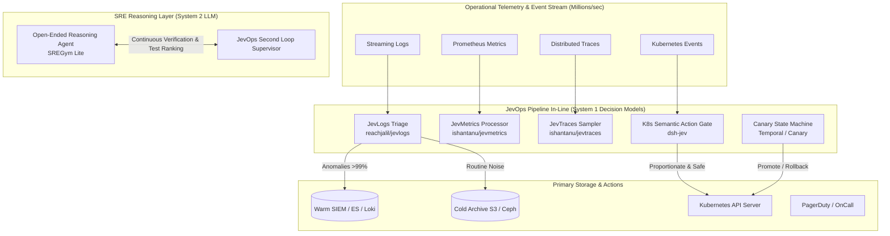

# JevOps: Decision Models for Cloud-Native Infrastructure & DevOps

[](LICENSE)
[](docs/03-airgap-openshift-4-20.md)
[](docs/04-hyperscaler-architectures.md)
[](components/01-semantic-telemetry-otel/)
[](tests/)

> *"DevOps may be one of the largest untapped use cases for decision models... DevOps is packed with exactly the kind of small semantic decisions Jev is built to make."*  
> — **Josh Rosen** ([@JoshARosen](https://x.com/JoshARosen/status/2104201747732271519))

---

## 📖 Overview

**JevOps** implements the full operational paradigm and all referenced systems from Josh Rosen's foundational article on **Decision Models in DevOps**.

Instead of routing operational infrastructure through slow (2–15s), expensive ($5–$20/1M tokens) generative LLMs, JevOps introduces **System 1 Decision Models** (exemplified by TypeSafe's Jev):
- **Reflexive & Fast**: 50ms – 250ms cloud latency, or **<1ms** with the local air-gapped engine.
- **Micro-Cost**: ~$0.042 per million input tokens (~1% of LLM cost), enabling continuous semantic decisions across millions of telemetry events.
- **Strictly Typed & Schema-Constrained**: Emits typed primitives (`Choice`, `Score`, `Noul`/boolean) with confidence probabilities—**zero hallucinations**.
- **Embedded in Operational Pipelines**: Placed directly inside OpenTelemetry Collectors, Kubernetes Admission Webhooks, SRE Dual-Loop supervisors, CI/CD runners, and Progressive Delivery controllers.
- **Enterprise Ready**: Turnkey support for **Red Hat OpenShift 4.20+ (on-prem air-gapped and cloud ROSA/ARO)**, **AKS**, **EKS**, and **GKE**.

---

## 🏛 Architecture: System 1 vs System 2 in DevOps



---

## 📚 Complete Reference Atlas

This repository contains fully tested, working code implementations of every reference cited in Josh Rosen's article:

| Reference | Domain | JevOps Implementation | Documentation |
| :--- | :--- | :--- | :--- |
| **Cribl AI Research** | Telemetry Pipelines & Parser Selection | [`components/01-semantic-telemetry-otel/`](components/01-semantic-telemetry-otel/) | [Docs](docs/02-reference-atlas.md#1-cribl-ai-research) |
| **`reachjalil/jevlogs`** | Log Triage & HDFS/BGL Benchmark | [`jevlogs_triage.py`](components/01-semantic-telemetry-otel/jevlogs_triage.py) | [Docs](docs/02-reference-atlas.md#2-jev-logs) |
| **`jevernetes`** | Live Kubernetes Log Inspection | [`core/local_engine.py`](core/jevops_core/local_engine.py) | [Docs](docs/02-reference-atlas.md#3-jevernetes) |
| **`jevbrief`** | Log Context Compression (1,447 logs -> 23 clusters) | [`jevbrief_compressor.py`](components/01-semantic-telemetry-otel/jevbrief_compressor.py) | [Docs](docs/02-reference-atlas.md#4-jevbrief) |
| **`ishantanu/jevmetrics`** | Metric Metadata Evaluation & Churn Reduction | [`jevmetrics_processor.py`](components/01-semantic-telemetry-otel/jevmetrics_processor.py) | [Docs](docs/02-reference-atlas.md#5-jevmetrics) |
| **`ishantanu/jevtraces`** | Span Criticality & Tail Sampling | [`jevtraces_tail_sampler.py`](components/01-semantic-telemetry-otel/jevtraces_tail_sampler.py) | [Docs](docs/02-reference-atlas.md#6-jevtraces) |
| **Datadog Agent Evals** | Online Evaluation of Production Agent Spans | [`core/client.py`](core/jevops_core/client.py) | [Docs](docs/02-reference-atlas.md#7-datadog-agent-observability) |
| **`SREGym Lite`** | SRE Dual-Loop Architecture & Test Ranking | [`components/03-sre-agent-dual-loop/`](components/03-sre-agent-dual-loop/) | [Docs](docs/02-reference-atlas.md#8-sregym-lite) |
| **`dsh-jev` (DeepSeek)** | K8s Semantic Action Gates (Postgres Exposure) | [`components/02-k8s-semantic-action-gate/`](components/02-k8s-semantic-action-gate/) | [Docs](docs/02-reference-atlas.md#9-semantic-gates-on-actions) |
| **`jev-oncall` / Router** | Confidence-Gated Alert Decomposition | [`components/05-incident-decomposition/`](components/05-incident-decomposition/) | [Docs](docs/02-reference-atlas.md#10-incident-response-decomposition) |
| **`jev-ci-pathfinder`** | Semantic CI Test & Job Selection | [`components/06-ci-semantic-pathfinder/`](components/06-ci-semantic-pathfinder/) | [Docs](docs/02-reference-atlas.md#11-ci-and-semantic-selection) |
| **Deployment State Machine** | Progressive Delivery Hold/Promote/Rollback | [`components/04-progressive-delivery/`](components/04-progressive-delivery/) | [Docs](docs/02-reference-atlas.md#12-progressive-delivery) |
| **John Rood's Law** | Resilient Degraded Defaults ("Fail Toward Noise") | [`core/fallback.py`](core/jevops_core/fallback.py) | [Docs](docs/05-resilience-and-fallbacks.md) |

---

## ⚡ Interactive Demos

Run all 5 scenarios end-to-end with zero dependencies:

```bash
bash demos/run_all_demos.sh
```

| Demo Script | Scenario | Outcome |
| :--- | :--- | :--- |
| **`demo1_otel_log_triage.py`** | Streams 250 records through log triager | **100% anomaly recall**, 100% routine noise filtered in 0.01s |
| **`demo2_k8s_action_gate.py`** | SRE agent proposes wide NetworkPolicy | **Blocks** `0.0.0.0/0` Postgres exposure; **Approves** scoped pod policy |
| **`demo3_sre_dual_loop.py`** | Dual-loop Kubernetes crash troubleshooting | Ranks hypotheses, gates premature diagnosis, verifies mitigation |
| **`demo4_canary_rollback.py`** | Progressive canary rollout with latency spike | Promotes 5% -> 25%, detects DB deadlock at 45% -> **Instant Rollback** |
| **`demo5_airgap_and_failover.py`** | Offline execution & intentional decider outage | Validates local engine & **John Rood's "Fail Toward Noise"** law |

---

## 🛡 John Rood's Law of Degraded Defaults

A fundamental operational requirement: **What does the pipeline do when the decider is down or slow?**

> *"Pick the degraded default per decision, and pick it toward noise: keep everything, page anyway. The only calls that get to fail quiet are the reversible ones."*

- **Reversible decisions** (e.g. Telemetry routing): Fail toward noise -> **retain 100% of logs, metrics, and traces**.
- **Irreversible mutations** (e.g. Kubernetes admission): Fail safe -> **block the change**.
- **Alert notifications**: Fail toward noise -> **page the oncall engineer anyway**.
- **Circuit Breaker**: Built-in circuit breaker trips `OPEN` if latency exceeds the 250ms SLA, protecting pipeline throughput.

---

## 🚀 Multi-Platform Deployment

### 1. Red Hat OpenShift 4.20+ (Air-Gapped & Disconnected)
Deploy the local decision engine sidecar with strict `restricted-v2` SCC compliance:
```bash
# Apply Security Context Constraints and deployment
oc apply -f deploy/openshift-4.20/scc-restricted-v2.yaml
oc apply -f deploy/openshift-4.20/local-decision-engine-pod.yaml
oc apply -f deploy/openshift-4.20/network-policy.yaml
```
For disconnected registry mirroring, use [`deploy/openshift-4.20/oc-mirror-imageset.yaml`](deploy/openshift-4.20/oc-mirror-imageset.yaml).

### 2. Hyperscalers: AKS, EKS, and GKE (Helm 3)
```bash
# Install via Helm with platform preset:
helm install jevops-suite ./helm/jevops-suite \
  --namespace jevops-system --create-namespace \
  --set global.platform=aks   # Or: eks, gke, openshift-airgap
```

---

## 🧪 Testing & Verification

Run the full automated test suite:
```bash
python3 -m unittest discover -s tests -p "test_*.py" -v
```

All 11 tests pass with zero external pip dependencies.

---

## 📄 License

Apache License 2.0. Copyright 2026 Nubenetes Authors.
