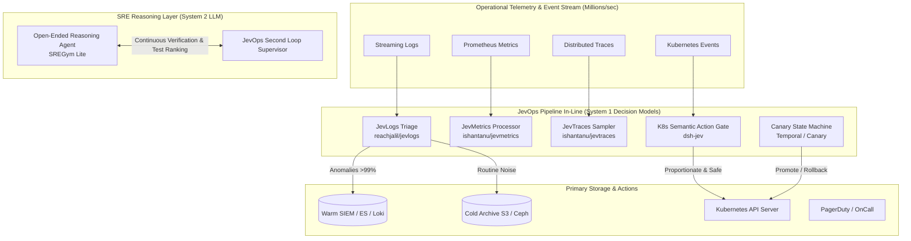

# JevOps: Decision Models for Cloud-Native Infrastructure & DevOps

[](LICENSE)
[](#%EF%B8%8F-disclaimer--architectural-reference)
[](#%EF%B8%8F-disclaimer--architectural-reference)
[](docs/03-airgap-openshift-4-20.md)
[](docs/04-hyperscaler-architectures.md)
[](components/01-semantic-telemetry-otel/)
[](tests/)

> [!WARNING]
> ### ⚠️ Disclaimer & AI Provenance
> This repository was architected and generated with **Gemini 3.8 Flash** based on Josh Rosen's article [*"JevOps: Early Signs Decision Models Are Transforming DevOps"*](https://x.com/JoshARosen/status/2104201747732271519) and its referenced ecosystem projects.
>
> **Architectural Reference Only — Not Tested in Production**:
> - This project serves strictly as an **architectural reference, conceptual blueprint, and educational proof-of-concept (PoC)** to catalyze exploration of System 1 decision models in cloud-native infrastructure.
> - **It has NOT been tested in a real production environment**, live OpenShift 4.20+ datacenter, or live hyperscaler cluster (AKS/EKS/GKE).
> - All Kubernetes manifests, SecurityContextConstraints, NetworkPolicies, Helm charts, and webhook controllers are illustrative and must be thoroughly audited, tested, and validated by your platform team in isolated non-production sandbox environments before any operational adoption.

> *"DevOps may be one of the largest untapped use cases for decision models... DevOps is packed with exactly the kind of small semantic decisions Jev is built to make."*  
> — **Josh Rosen** ([@JoshARosen](https://x.com/JoshARosen/status/2104201747732271519))

---

<a id="quick-navigation-map"></a>
## 🗺️ Quick Navigation Map

This architectural reference implements an end-to-end framework for embedding **System 1 Decision Models** directly into cloud-native operational pipelines—supporting **Red Hat OpenShift 4.20+ (air-gapped disconnected)** and hyperscalers (**AKS**, **EKS**, **GKE**). Use this interactive map to navigate all platform components, Helm charts, automated tests, and multimedia walkthroughs:

### 🧭 Repository Architecture Blueprint
```text
jevops/                                      # ⚡ System 1 Decision Models for Cloud-Native Infrastructure
├── 📁 airgap-decision-server/               # Offline Decision Server & Local Sidecar Engine
│   ├── 📄 Dockerfile                        # Air-gapped container image definition
│   ├── 📄 requirements.txt                  # Minimal dependencies (FastAPI, uvicorn, pydantic)
│   └── 📄 server.py                         # Submillisecond local REST decision server
├── 📁 components/                           # Production Cloud-Native Architectural Components
│   ├── 📁 01-semantic-telemetry-otel/       # In-line OpenTelemetry telemetry processors
│   │   ├── 📄 jevlogs_triage.py             # Log triage & anomaly routing (HDFS/BGL benchmark)
│   │   ├── 📄 jevmetrics_processor.py       # Metric churn reducer & metadata evaluator
│   │   ├── 📄 jevtraces_tail_sampler.py     # Distributed trace span evaluation & tail sampler
│   │   ├── 📄 jevbrief_compressor.py        # Context compression (1447 logs to 23 clusters)
│   │   └── 📄 otel-collector-config.yaml    # Declarative OpenTelemetry Collector pipeline
│   ├── 📁 02-k8s-semantic-action-gate/      # Kubernetes Dynamic Admission Webhook & Policy Gate
│   │   ├── 📄 webhook_server.py             # Semantic admission controller interceptor
│   │   ├── 📄 gatekeeper_evaluator.py       # Gatekeeper/OPA policy evaluator for dangerous actions
│   │   └── 📄 kyverno-policy.yaml           # Kyverno declarative policy definition
│   ├── 📁 03-sre-agent-dual-loop/           # SRE Autonomous Agent Dual-Loop Architecture
│   │   ├── 📄 sre_supervisor.py             # Fast System 1 supervisor gating System 2 claims
│   │   └── 📄 mock_reasoning_agent.py       # Simulated open-ended LLM diagnostic agent
│   ├── 📁 04-progressive-delivery/          # Canary Deployment & Automated State Machine
│   │   ├── 📄 canary_state_machine.py       # Deterministic hold, promote, rollback controller
│   │   └── 📄 argo-analysis-template.yaml   # Argo Rollouts declarative AnalysisTemplate
│   ├── 📁 05-incident-decomposition/        # Confidence-Gated Alert & Security Triage
│   │   ├── 📄 triage_router.py              # Exact lookup + semantic routing + human escalation
│   │   └── 📄 secops_pipeline.py            # Multi-stage security incident containment
│   └── 📁 06-ci-semantic-pathfinder/        # Intelligent CI Runner & Test Suite Pruning
│       └── 📄 pathfinder.py                 # Semantic git diff analysis for targeted test runs
├── 📁 core/                                 # Core JevOps Python Client & Local Execution Engine
│   ├── 📁 jevops_core/                      # Core module implementation
│   │   ├── 📄 primitives.py                 # Strictly typed primitives (Choice, Score, Noul)
│   │   ├── 📄 client.py                     # High-performance REST client with circuit breaker
│   │   ├── 📄 local_engine.py               # Deterministic submillisecond local engine
│   │   └── 📄 fallback.py                   # John Rood's Law degraded default strategies
│   └── 📄 pyproject.toml                    # Package metadata & build definition
├── 📁 demos/                                # Zero-Dependency Interactive Scenarios
│   ├── 📄 demo1_otel_log_triage.py          # 250 log records triage (100% anomaly recall)
│   ├── 📄 demo2_k8s_action_gate.py          # Blocks 0.0.0.0/0 Postgres exposure
│   ├── 📄 demo3_sre_dual_loop.py            # Gates premature diagnosis & verifies mitigation
│   ├── 📄 demo4_canary_rollback.py          # Latency spike & deadlock -> instant rollback
│   ├── 📄 demo5_airgap_and_failover.py      # Circuit breaker & "Fail Toward Noise" validation
│   └── 📄 run_all_demos.sh                  # One-click execution of all 5 scenarios
├── 📁 deploy/                               # Multi-Platform Enterprise Deployment Manifests
│   ├── 📁 openshift-4.20/                   # Red Hat OpenShift air-gapped manifests
│   │   ├── 📄 scc-restricted-v2.yaml        # restricted-v2 SCC compliance
│   │   ├── 📄 local-decision-engine-pod.yaml# Local sidecar pod deployment
│   │   ├── 📄 network-policy.yaml           # Zero-trust cluster ingress/egress policies
│   │   ├── 📄 route-tls.yaml                # Edge TLS re-encrypt OpenShift Route
│   │   └── 📄 oc-mirror-imageset.yaml       # Disconnected registry mirroring configuration
│   ├── 📁 aks/                              # Microsoft Azure Kubernetes Service (Workload ID)
│   ├── 📁 eks/                              # Amazon Elastic Kubernetes Service (IRSA)
│   └── 📁 gke/                              # Google Kubernetes Engine (Workload Identity)
├── 📁 docs/                                 # Exhaustive Architectural Documentation & Guides
│   ├── 📄 01-jevops-manifesto.md            # Foundational philosophy: System 1 vs System 2
│   ├── 📄 02-reference-atlas.md             # Complete breakdown of all 12 literature references
│   ├── 📄 03-airgap-openshift-4-20.md        # Air-gapped disconnected OpenShift 4.20+ guide
│   ├── 📄 04-hyperscaler-architectures.md   # Production deployment on AKS, EKS, and GKE
│   └── 📄 05-resilience-and-fallbacks.md    # Circuit breaking & John Rood's Law specification
├── 📁 helm/                                 # Production Helm 3 Packaging
│   └── 📁 jevops-suite/                     # Umbrella chart with AKS/EKS/GKE/OpenShift presets
└── 📁 tests/                                # Automated Unit & Verification Test Suite
    ├── 📄 test_core_primitives.py           # Verification of typed schemas & calibrations
    ├── 📄 test_otel_processors.py           # Verification of log, metric, trace filters
    ├── 📄 test_k8s_action_gate.py           # Admission gate security rules validation
    ├── 📄 test_resilience_circuit_breaker.py# Circuit breaker SLA & degraded defaults tests
    └── 📄 test_airgap_local_engine.py       # Offline local engine benchmarking (under 1ms)
```

<a id="ai-multimedia-series"></a>
## 🎬 AI-Generated Multimedia Series (YouTube)

This repository is accompanied by an educational video masterclass series and technical shorts synthesized with **Gemini NotebookLM** based directly on the System 1 decision models, air-gapped OpenShift 4.20+ blueprints, and resilient cloud-native patterns from this project. All videos are freely accessible on YouTube on the [**@nubenetes**](https://youtube.com/@nubenetes) channel.

> [!NOTE]
> **Multilingual Learning Experience**:  
> Content features sessions with original spoken audio in **English 🇺🇸**, with automated YouTube closed captions (CC) translated into **20+ languages** for global platform engineering and SRE teams.

### 📽️ Full-Length Technical Deep Dives (Architecture Masterclasses)

| # | Video Guide Title | Engineering Domain & Core Architecture | Audio | Duration | Direct Link |
|:---:|:---|:---|:---:|:---:|:---:|
| **01** | [JevOps Masterclass: System 1 Decision Models](https://www.youtube.com/watch?v=fWuANFzkH7E) | **Architectural Foundation & Dual-Loop SRE**<br/>The AI bottleneck, strictly typed primitives, telemetry gates & resilient defaults | 🇺🇸 EN | `10:49` | [▶️ Watch](https://www.youtube.com/watch?v=fWuANFzkH7E) |
| **02** | [JevOps Guide: Multi-Platform Deployment](https://www.youtube.com/watch?v=T7F0ngoCVJY) | **Air-Gapped OpenShift 4.20+ & Cloud GitOps**<br/>restricted-v2 SCC, oc-mirror, Helm 3 for AKS/EKS/GKE, CI pathfinder | 🇺🇸 EN | `7:33` | [▶️ Watch](https://www.youtube.com/watch?v=T7F0ngoCVJY) |

### ⚡ Video Shorts Matrix

| # | Short Title | Architectural Domain & Focus | Audio | Duration | Action |
|:---:|:---|:---|:---:|:---:|:---:|
| **01** | [How System 1 Decision Models Filter Kubernetes](https://www.youtube.com/shorts/4OCgH8OY-vs) | **In-Line Telemetry Triage**<br/>Submillisecond log filtering, dropping 99% noise & fail-open circuit breakers | 🇺🇸 EN | `1:25` | [▶️ Watch](https://www.youtube.com/shorts/4OCgH8OY-vs) |
| **02** | [How AI Fails Safely in Cloud Infrastructure](https://www.youtube.com/shorts/XAzQerywCQw) | **Operational Resilience**<br/>John Rood's Law of Degraded Defaults, fail-safe vs fail-toward-noise | 🇺🇸 EN | `1:10` | [▶️ Watch](https://www.youtube.com/shorts/XAzQerywCQw) |

*For complete technical summaries, topic breakdowns, and direct studio links, see [Video Walkthroughs & Architecture References](#video-walkthroughs).*

---

## 📖 Overview

**JevOps** implements the full operational paradigm and all referenced systems from Josh Rosen's foundational article on **Decision Models in DevOps**.

Instead of routing operational infrastructure through slow (2–15s), expensive ($5–$20/1M tokens) generative LLMs, JevOps introduces **System 1 Decision Models** (exemplified by TypeSafe's Jev):
- **Reflexive & Fast**: 50ms – 250ms cloud latency, or **<1ms** with the local air-gapped engine.
- **Micro-Cost**: ~$0.042 per million input tokens (~1% of LLM cost), enabling continuous semantic decisions across millions of telemetry events.
- **Strictly Typed & Schema-Constrained**: Emits typed primitives (`Choice`, `Score`, `Noul`/boolean) with confidence probabilities—**zero hallucinations**.
- **Embedded in Operational Pipelines**: Placed directly inside OpenTelemetry Collectors, Kubernetes Admission Webhooks, SRE Dual-Loop supervisors, CI/CD runners, and Progressive Delivery controllers.
- **Enterprise Ready**: Turnkey support for **Red Hat OpenShift 4.20+ (on-prem air-gapped and cloud ROSA/ARO)**, **AKS**, **EKS**, and **GKE**.

---

## 🏛 Architecture: System 1 vs System 2 in DevOps



---

## 📚 Complete Reference Atlas

This repository contains fully tested, working code implementations of every reference cited in Josh Rosen's article:

| Reference | Domain | JevOps Implementation | Documentation |
| :--- | :--- | :--- | :--- |
| **Cribl AI Research** | Telemetry Pipelines & Parser Selection | [`components/01-semantic-telemetry-otel/`](components/01-semantic-telemetry-otel/) | [Docs](docs/02-reference-atlas.md#1-cribl-ai-research) |
| **`reachjalil/jevlogs`** | Log Triage & HDFS/BGL Benchmark | [`jevlogs_triage.py`](components/01-semantic-telemetry-otel/jevlogs_triage.py) | [Docs](docs/02-reference-atlas.md#2-jev-logs) |
| **`jevernetes`** | Live Kubernetes Log Inspection | [`core/local_engine.py`](core/jevops_core/local_engine.py) | [Docs](docs/02-reference-atlas.md#3-jevernetes) |
| **`jevbrief`** | Log Context Compression (1,447 logs -> 23 clusters) | [`jevbrief_compressor.py`](components/01-semantic-telemetry-otel/jevbrief_compressor.py) | [Docs](docs/02-reference-atlas.md#4-jevbrief) |
| **`ishantanu/jevmetrics`** | Metric Metadata Evaluation & Churn Reduction | [`jevmetrics_processor.py`](components/01-semantic-telemetry-otel/jevmetrics_processor.py) | [Docs](docs/02-reference-atlas.md#5-jevmetrics) |
| **`ishantanu/jevtraces`** | Span Criticality & Tail Sampling | [`jevtraces_tail_sampler.py`](components/01-semantic-telemetry-otel/jevtraces_tail_sampler.py) | [Docs](docs/02-reference-atlas.md#6-jevtraces) |
| **Datadog Agent Evals** | Online Evaluation of Production Agent Spans | [`core/client.py`](core/jevops_core/client.py) | [Docs](docs/02-reference-atlas.md#7-datadog-agent-observability) |
| **`SREGym Lite`** | SRE Dual-Loop Architecture & Test Ranking | [`components/03-sre-agent-dual-loop/`](components/03-sre-agent-dual-loop/) | [Docs](docs/02-reference-atlas.md#8-sregym-lite) |
| **`dsh-jev` (DeepSeek)** | K8s Semantic Action Gates (Postgres Exposure) | [`components/02-k8s-semantic-action-gate/`](components/02-k8s-semantic-action-gate/) | [Docs](docs/02-reference-atlas.md#9-semantic-gates-on-actions) |
| **`jev-oncall` / Router** | Confidence-Gated Alert Decomposition | [`components/05-incident-decomposition/`](components/05-incident-decomposition/) | [Docs](docs/02-reference-atlas.md#10-incident-response-decomposition) |
| **`jev-ci-pathfinder`** | Semantic CI Test & Job Selection | [`components/06-ci-semantic-pathfinder/`](components/06-ci-semantic-pathfinder/) | [Docs](docs/02-reference-atlas.md#11-ci-and-semantic-selection) |
| **Deployment State Machine** | Progressive Delivery Hold/Promote/Rollback | [`components/04-progressive-delivery/`](components/04-progressive-delivery/) | [Docs](docs/02-reference-atlas.md#12-progressive-delivery) |
| **John Rood's Law** | Resilient Degraded Defaults ("Fail Toward Noise") | [`core/fallback.py`](core/jevops_core/fallback.py) | [Docs](docs/05-resilience-and-fallbacks.md) |

---

## ⚡ Interactive Demos

Run all 5 scenarios end-to-end with zero dependencies:

```bash
bash demos/run_all_demos.sh
```

| Demo Script | Scenario | Outcome |
| :--- | :--- | :--- |
| **`demo1_otel_log_triage.py`** | Streams 250 records through log triager | **100% anomaly recall**, 100% routine noise filtered in 0.01s |
| **`demo2_k8s_action_gate.py`** | SRE agent proposes wide NetworkPolicy | **Blocks** `0.0.0.0/0` Postgres exposure; **Approves** scoped pod policy |
| **`demo3_sre_dual_loop.py`** | Dual-loop Kubernetes crash troubleshooting | Ranks hypotheses, gates premature diagnosis, verifies mitigation |
| **`demo4_canary_rollback.py`** | Progressive canary rollout with latency spike | Promotes 5% -> 25%, detects DB deadlock at 45% -> **Instant Rollback** |
| **`demo5_airgap_and_failover.py`** | Offline execution & intentional decider outage | Validates local engine & **John Rood's "Fail Toward Noise"** law |

---

## 🛡 John Rood's Law of Degraded Defaults

A fundamental operational requirement: **What does the pipeline do when the decider is down or slow?**

> *"Pick the degraded default per decision, and pick it toward noise: keep everything, page anyway. The only calls that get to fail quiet are the reversible ones."*

- **Reversible decisions** (e.g. Telemetry routing): Fail toward noise -> **retain 100% of logs, metrics, and traces**.
- **Irreversible mutations** (e.g. Kubernetes admission): Fail safe -> **block the change**.
- **Alert notifications**: Fail toward noise -> **page the oncall engineer anyway**.
- **Circuit Breaker**: Built-in circuit breaker trips `OPEN` if latency exceeds the 250ms SLA, protecting pipeline throughput.

---

## 🚀 Multi-Platform Deployment

### 1. Red Hat OpenShift 4.20+ (Air-Gapped & Disconnected)
Deploy the local decision engine sidecar with strict `restricted-v2` SCC compliance:
```bash
# Apply Security Context Constraints and deployment
oc apply -f deploy/openshift-4.20/scc-restricted-v2.yaml
oc apply -f deploy/openshift-4.20/local-decision-engine-pod.yaml
oc apply -f deploy/openshift-4.20/network-policy.yaml
```
For disconnected registry mirroring, use [`deploy/openshift-4.20/oc-mirror-imageset.yaml`](deploy/openshift-4.20/oc-mirror-imageset.yaml).

### 2. Hyperscalers: AKS, EKS, and GKE (Helm 3)
```bash
# Install via Helm with platform preset:
helm install jevops-suite ./helm/jevops-suite \
  --namespace jevops-system --create-namespace \
  --set global.platform=aks   # Or: eks, gke, openshift-airgap
```

---

## 🧪 Testing & Verification

Run the full automated test suite:
```bash
python3 -m unittest discover -s tests -p "test_*.py" -v
```

All 11 tests pass with zero external pip dependencies.

---

---

<a id="video-walkthroughs"></a>
## 📺 Video Walkthroughs & Architecture References (YouTube)

Architectural deep dives, video walkthroughs, and technical shorts for `jevops`, System 1 decision models, air-gapped OpenShift 4.20+ deployments, and resilient cloud-native pipelines are hosted on the **[Nubenetes YouTube Channel (@nubenetes)](https://www.youtube.com/@nubenetes)**.

<details open>
<summary>📂 <strong>Full-Length Technical Deep Dives (Architecture Masterclasses)</strong></summary>

<br/>

##### 1. JevOps Masterclass: System 1 Decision Models for Cloud-Native Infrastructure & DevOps
- 🔗 **Direct Link**: [https://www.youtube.com/watch?v=fWuANFzkH7E](https://www.youtube.com/watch?v=fWuANFzkH7E)
- 🌐 **Origin Language**: English 🇺🇸 (Subtitles in 20+ languages)
- ⏱️ **Duration**: 10:49
- 🏷️ **Engineering Domain**: Architectural Deep Dive, System 1 vs System 2, Dual-Loop SRE & Resilient Cloud Pipelines
- 📝 **Technical Overview**:
Complete architectural masterclass exploring why traditional generative LLMs break down in high-throughput cloud-native environments (2-15s latency, 0/1M tokens, hallucinatory prose) and how System 1 Decision Models solve the bottleneck. Covers reflexive micro-cost judgments (bash.042/1M tokens, under 1ms local latency), strictly typed schema primitives (Choice, Score, Noul), SRE dual-loop supervisory architectures (SREGym Lite), semantic telemetry filtering in OpenTelemetry Collectors (JevLogs, JevMetrics, JevTraces), Kubernetes admission mutation gates, progressive canary state machines, and John Rood's Law of Degraded Defaults.
- 🛠️ **Direct Links**: [Watch on YouTube](https://www.youtube.com/watch?v=fWuANFzkH7E) | [Edit in YouTube Studio](https://studio.youtube.com/video/fWuANFzkH7E/edit)

##### 2. JevOps Guide: Deploying System 1 Decision Models on OpenShift 4.20+ & Hyperscalers
- 🔗 **Direct Link**: [https://www.youtube.com/watch?v=T7F0ngoCVJY](https://www.youtube.com/watch?v=T7F0ngoCVJY)
- 🌐 **Origin Language**: English 🇺🇸 (Subtitles in 20+ languages)
- ⏱️ **Duration**: 7:33
- 🏷️ **Engineering Domain**: Operational Deployment Guide, Air-Gapped OpenShift 4.20+, Hyperscalers & CI/CD
- 📝 **Technical Overview**:
Hands-on operational deployment and lifecycle guide for running System 1 Decision Models across disconnected enterprise datacenters and multi-cloud Kubernetes. Details Day 1 deployment on air-gapped Red Hat OpenShift 4.20+ with restricted-v2 SecurityContextConstraints, local container sidecars, and oc-mirror ImageSet configurations; multi-cloud Helm 3 charts for AKS, EKS, and GKE; Day 2 telemetry churn reduction and massive SIEM storage cost savings; intelligent pull request test suite pruning via Jev CI Pathfinder; and automated circuit breaking with fail-toward-noise fallbacks.
- 🛠️ **Direct Links**: [Watch on YouTube](https://www.youtube.com/watch?v=T7F0ngoCVJY) | [Edit in YouTube Studio](https://studio.youtube.com/video/T7F0ngoCVJY/edit)

</details>

<details open>
<summary>📂 <strong>Technical Shorts Matrix & Architecture Breakdowns</strong></summary>

<br/>

### ⚡ Video Shorts Matrix

| # | Short Title | Architectural Domain & Focus | Audio | Duration | Action |
|:---:|:---|:---|:---:|:---:|:---:|
| **01** | [How System 1 Decision Models Filter Kubernetes](https://www.youtube.com/shorts/4OCgH8OY-vs) | **In-Line Telemetry Triage**<br/>Submillisecond log filtering, dropping 99% noise & fail-open circuit breakers | 🇺🇸 EN | `1:25` | [▶️ Watch](https://www.youtube.com/shorts/4OCgH8OY-vs) |
| **02** | [How AI Fails Safely in Cloud Infrastructure](https://www.youtube.com/shorts/XAzQerywCQw) | **Operational Resilience**<br/>John Rood's Law of Degraded Defaults, fail-safe vs fail-toward-noise | 🇺🇸 EN | `1:10` | [▶️ Watch](https://www.youtube.com/shorts/XAzQerywCQw) |

<br/>

##### 1. How System 1 Decision Models Filter Kubernetes Logs at Submillisecond Speeds
- 🔗 **Direct Link**: [https://www.youtube.com/shorts/4OCgH8OY-vs](https://www.youtube.com/shorts/4OCgH8OY-vs)
- 🌐 **Origin Language**: English 🇺🇸 (Subtitles in 20+ languages)
- ⏱️ **Duration**: 1:25
- 🏷️ **Engineering Domain**: In-Line Telemetry Triage, Submillisecond Filtering & K8s Admission Gates
- 📝 **Technical Overview**:
How System 1 decision models make submillisecond judgments directly inside high-volume Kubernetes telemetry streams without generating open-ended text. Explains dropping 99% of routine log noise while routing high-confidence anomalies to warm storage, blocking dangerous configuration exposures (such as 0.0.0.0/0 database exposure), and using fail-open circuit breakers to prevent data loss.
- 🛠️ **Direct Links**: [Watch Short](https://www.youtube.com/shorts/4OCgH8OY-vs) | [Edit in YouTube Studio](https://studio.youtube.com/video/4OCgH8OY-vs/edit)

##### 2. How AI Fails Safely in Cloud Infrastructure: John Rood's Law Explained
- 🔗 **Direct Link**: [https://www.youtube.com/shorts/XAzQerywCQw](https://www.youtube.com/shorts/XAzQerywCQw)
- 🌐 **Origin Language**: English 🇺🇸 (Subtitles in 20+ languages)
- ⏱️ **Duration**: 1:10
- 🏷️ **Engineering Domain**: Operational Resilience, Degraded Defaults & Circuit Breakers
- 📝 **Technical Overview**:
How John Rood's Law of Degraded Defaults stops AI gatekeeper failures from crashing cloud infrastructure. Details why operational decisions must be categorized by reversibility: failing safe (hardlocking) on irreversible mutations like database deployments, and failing toward noise (passing logs and paging on-call engineers) on reversible operational alerts, backed by a 250ms circuit breaker.
- 🛠️ **Direct Links**: [Watch Short](https://www.youtube.com/shorts/XAzQerywCQw) | [Edit in YouTube Studio](https://studio.youtube.com/video/XAzQerywCQw/edit)

</details>

## ⚠️ Disclaimer & Architectural Reference

This project is an **architectural reference and educational prototype**:
- **Generative AI Origin**: Architected and created by **Gemini 3.8 Flash** based on the theoretical concepts of System 1 decision models in DevOps by TypeSafe AI and community experiments.
- **Production Status**: **Not tested in a real production environment**. While the included test suite passes locally with synthetic data, running these components in enterprise infrastructure requires full operational validation, load testing against production telemetry streams, and security hardening.
- **No Warranty**: Provided as-is under the Apache 2.0 License. Operators assume all responsibility for reviewing, securing, and adapting these patterns prior to non-development use.

---

## 📄 License

Apache License 2.0. Copyright 2026 Nubenetes Authors.

---

## 🌐 Classified Internet References & Bibliography

Below is the complete classified directory of foundational literature, community implementations, and practitioner insights utilized throughout this repository:

### 1. Foundational Literature & Decision Model Theory
- [**Josh Rosen: JevOps — Early Signs Decision Models Are Transforming DevOps**](https://x.com/JoshARosen/status/2104201747732271519)  
  *Summary*: The foundational thesis demonstrating how System 1 decision models (exemplified by TypeSafe's Jev) provide micro-cost (~$0.04/1M tokens) and ultra-low-latency (50–250ms) structured judgments across telemetry, SRE loops, admission gates, and CI/CD.
- [**TypeSafe AI Documentation**](https://docs.typesafe.ai) & [**Console**](https://console.typesafe.ai)  
  *Summary*: Official documentation and developer console for the Jev "System One" decision model API (`POST /v1/systemone`), specifying `Choice`, `Score`, and `Noul` typed primitives with calibrated probabilities.
- [**Awesome-Jev Community Index**](https://github.com/AppitStudio/awesome-jev)  
  *Summary*: Curated community repository aggregating open-source integrations, SDKs, and workflow patterns leveraging Jev decision models.

### 2. Semantic Telemetry & Observability Pipelines (Logs, Metrics, Traces)
- [**Cribl AI Research: What TypeSafe's Jev Means for Telemetry**](https://cribl.io/blog/what-typesafes-jev-means-for-telemetry/)  
  *Summary*: Production investigation into telemetry pipelines showing that Jev achieved 92% agreement with an LLM judge committee at 1% of the cost for parser selection, PII detection, and span eval.
- [**Jev Logs**](https://jevlogs.com/) | [**GitHub (`reachjalil/jevlogs`)**](https://github.com/reachjalil/jevlogs)  
  *Summary*: OpenTelemetry log exporter wrapper that scores diagnostic relevance and routes anomalous records toward warm analysis while archiving routine noise.
- [**HuggingFace JevLogs Benchmark**](https://huggingface.co/datasets/reachjalil/jevlogs-log-triage-benchmark)  
  *Summary*: Benchmark across sanitized HDFS and BGL supercomputer log datasets demonstrating >99.3% anomaly recall while filtering over 99% of total routine records.
- [**Jevernetes**](https://jevlist.ai/projects/jevernetes)  
  *Summary*: Live Kubernetes log analyzer that highlights anomalous pod events, reconstructs surrounding context windows, and provides evidence packets for coding agents with offline keyword fallbacks.
- [**JevBrief (PyPI: `jevbrief/0.1.0`)**](https://pypi.org/project/jevbrief/0.1.0/)  
  *Summary*: Operational context compressor that clusters thousands of raw OpenTelemetry logs into semantic templates, isolates top candidates, and selects the root-cause explanation.
- [**JevMetrics (`ishantanu/jevmetrics`)**](https://github.com/ishantanu/jevmetrics)  
  *Summary*: Experimental OpenTelemetry Collector metrics processor evaluating metric instrument metadata to prune redundant high-cardinality churn via `annotate`, `route`, and `reduce` modes.
- [**JevTraces (`ishantanu/jevtraces`)**](https://github.com/ishantanu/jevtraces)  
  *Summary*: Distributed trace span evaluation experiment optimizing OpenTelemetry tail sampling by assessing operational diagnostic utility and business criticality while preserving full raw archives.
- [**Datadog Agent Observability: Jev Evals**](https://www.datadoghq.com/blog/jev-evals-agent-observability/)  
  *Summary*: Real-time online evaluation of production agent spans as they arrive, verifying claims, classifying failures, and checking policy compliance in-flight.

### 3. SRE Autonomous Agents & Runtime Safety Gates
- [**SREGym Lite: SRE Agents in a Second Loop**](https://sregym.com/blog/jev-sregym-lite)  
  *Summary*: Benchmark and architecture showing a dual-loop SRE design where a fast System 1 decision supervisor monitors an open-ended reasoning LLM, ranking diagnostic tests and gating mitigation claims to boost benchmark success from 40% to 48%.
- [**DeepSeek Harness Jev Plugin (`buberlo/dsh-jev`)**](https://github.com/buberlo/dsh-jev)  
  *Summary*: Semantic action gate in DeepSeek Harness Kubernetes troubleshooting that intercepts proposed mutations (e.g. broad NetworkPolicies that expose PostgreSQL) and blocks disproportionate actions before execution.

### 4. Incident Response & Decomposition
- [**Jev OnCall**](https://jevcases.com/cases/jev-oncall/)  
  *Summary*: Incident triage framework that evaluates incoming alerts semantically while traditional deterministic code determines whether the result triggers paging, review queues, or suppression.
- [**TypeSafe Jev Incident Router (`kyle-chalmers/typesafe-jev-incident-router`)**](https://github.com/kyle-chalmers/typesafe-jev-incident-router)  
  *Summary*: Confidence-gated incident dispatching system using exact ownership lookups first, routing via Jev for ambiguous tickets, and delegating low-confidence outputs to human review.
- [**Security Operations Jev Pipeline (`kenhuangus/jev-usecases`)**](https://github.com/kenhuangus/jev-usecases)  
  *Summary*: Multi-stage SecOps experiment decomposing security incident handling across triage, blast radius scoring, automated containment gating, and closeout verification.

### 5. Progressive Delivery & CI Selection
- [**Jev Deployment State Machine**](https://stacktoheap.com/demos/jev-deployment-state-machine/)  
  *Summary*: Progressive canary controller evaluating multi-dimensional health metrics at model-eligible rollout stages to execute deterministic `hold`, `promote`, or `rollback` transitions.
- [**Jev and Temporal Rollback Demo (`thenoahhein/jev-temporal-demo`)**](https://github.com/thenoahhein/jev-temporal-demo)  
  *Summary*: Combines Temporal workflow orchestration with Jev decision gates for automated canary rollback, allowing Temporal to manage durable state and retries without re-querying the model.
- [**Jev CI Pathfinder**](https://jevlist.ai/projects/jev-ci-pathfinder)  
  *Summary*: Intelligent CI runner that analyzes pull request git diffs semantically to select relevant optional test suites while keeping core security and lint checks always active.

### 6. Operational Resilience & Practitioner Insights
- [**John Rood on Degraded Defaults & Fail-Toward-Noise**](https://x.com/johnroodepic/status/2104206564429337061)  
  *Summary*: Essential operational principle: when the decision model is down or slow, pipelines must pick degraded defaults toward noise (keep all telemetry, page oncall anyway) and fail quiet only on reversible calls.
- [**Roni Rechter on DevOps and Decisions**](https://x.com/RechterRoni/status/2104227167815283098)  
  *Summary*: Practitioner observation highlighting that *"DevOps is mostly decisions with a YAML file attached"*, emphasizing the natural fit for micro-decision models.
- [**Mykhailo Sorochuk on Silent Pipeline Efficiency**](https://x.com/sir4K_zen/status/2104300732182831374)  
  *Summary*: Operational analysis noting how embedding decision models silently across logs, metrics, and traces provides a subtle yet pervasive efficiency boost across the cloud-native infrastructure stack.
