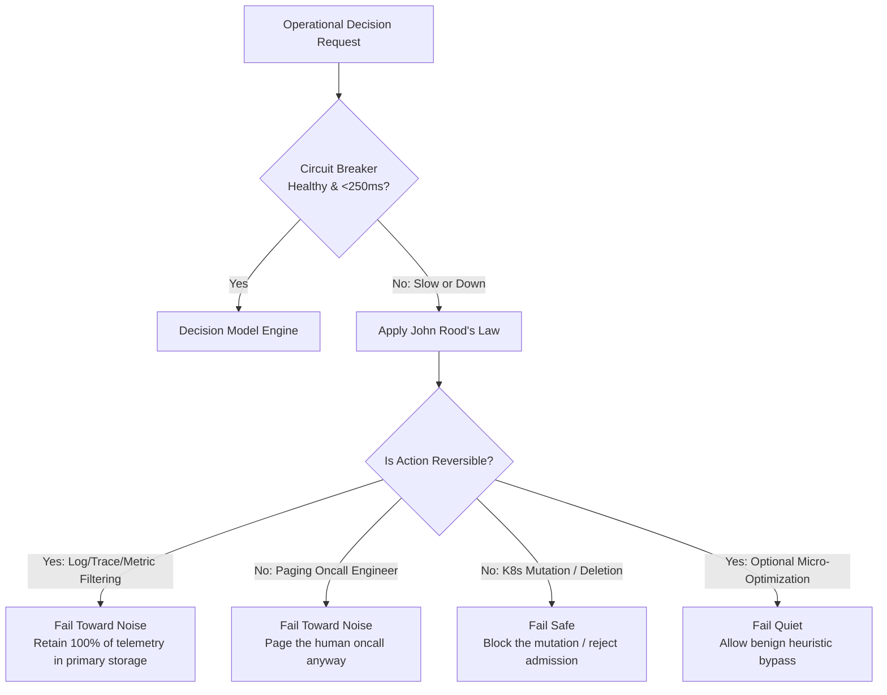

# Operational Resilience & Degraded Defaults: John Rood's Law

| [← Prev: **04. Hyperscalers (AKS/EKS/GKE)**](04-hyperscaler-architectures.md) | [🏠 **Home (README)**](../README.md) | [Restart: **01. JevOps Manifesto** →](01-jevops-manifesto.md) |
| :--- | :---: | ---: |

> *"The spec missing from every one of these: what the pipeline does when the decider is down or slow. Pick the degraded default per decision, and pick it toward noise: keep everything, page anyway. The only calls that get to fail quiet are the reversible ones."*  
> — **John Rood** ([@johnroodepic](https://x.com/johnroodepic/status/2104206564429337061))

---

## 1. The Fundamental Resilience Problem

In high-throughput cloud-native environments, no operational pipeline can depend synchronously on an external model endpoint without a bulletproof degraded fallback strategy.

If an AI decider:
- Times out (>250ms SLA)
- Suffers network partition
- Returns HTTP 500 / 429
- Crashes

What does the pipeline do?

---

## 2. John Rood's Law

John Rood formulated the definitive operational rule for AI decision models in infrastructure:

1. **Pick degraded defaults per decision question.**
2. **Pick toward noise**: If a decision drops or filters data, failing means keeping everything. If a decision controls alerting, failing means alerting anyway.
3. **Only reversible operations get to fail quiet**: If an action is irreversible (deleting a database, applying an over-permissive network policy, killing a pod), it **must fail safe (block)**.

---

## 3. Decision Default Matrix

| Domain | Decision Target | Reversibility | Degraded Default Policy | Operational Outcome |
| :--- | :--- | :--- | :--- | :--- |
| **Telemetry Logs** | `route`: warm vs cold | **Reversible** | `FAIL_TOWARD_NOISE` | Route to `warm_analysis` (keep everything) |
| **Telemetry Metrics** | `tier`: tsdb vs drop | **Reversible** | `FAIL_TOWARD_NOISE` | Retain in `primary_tsdb` |
| **Distributed Traces** | `sampling`: retain vs drop | **Reversible** | `FAIL_TOWARD_NOISE` | `retain_primary` (never discard traces) |
| **Incident Response** | `alert`: page vs suppress | **Irreversible** (wakes human) | `FAIL_TOWARD_NOISE` | `page_oncall_now` (never silence unverified alerts) |
| **Kubernetes Admission** | `gate`: approve vs block | **Irreversible** (cluster state) | `FAIL_SAFE_BLOCK` | `reject_disproportionate` (block changes) |
| **Canary Rollout** | `action`: promote vs rollback | **Irreversible** (user traffic) | `FAIL_SAFE_BLOCK` | `hold` (freeze traffic, do not promote) |
| **CI Pathfinder** | `select_job`: run vs skip | **Reversible** (compute cost) | `FAIL_TOWARD_NOISE` | Run the test job (guarantee safety) |

---

## 4. Production Circuit Breaker Implementation

The JevOps SDK includes a stateful circuit breaker in [`core/jevops_core/fallback.py`](../core/jevops_core/fallback.py):
- **SLA Enforcement**: Latency exceeding 250ms is classified as an operational breach.
- **Trip Conditions**: 3 consecutive breaches transition state from `CLOSED` to `OPEN`.
- **Zero Pipeline Blocking**: When `OPEN`, the client bypasses HTTP requests entirely, resolving local degraded defaults in `<0.01ms`.
- **Self-Healing**: After a 15-second cooldown, probes in `HALF_OPEN` state to resume normal operation automatically.

---

| [← Prev: **04. Hyperscalers (AKS/EKS/GKE)**](04-hyperscaler-architectures.md) | [🏠 **Home (README)**](../README.md) | [Restart: **01. JevOps Manifesto** →](01-jevops-manifesto.md) |
| :--- | :---: | ---: |

